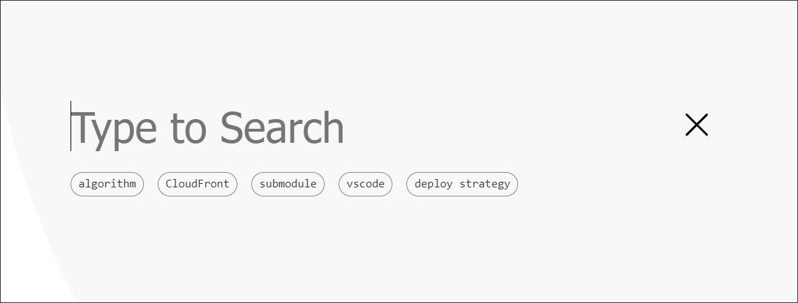
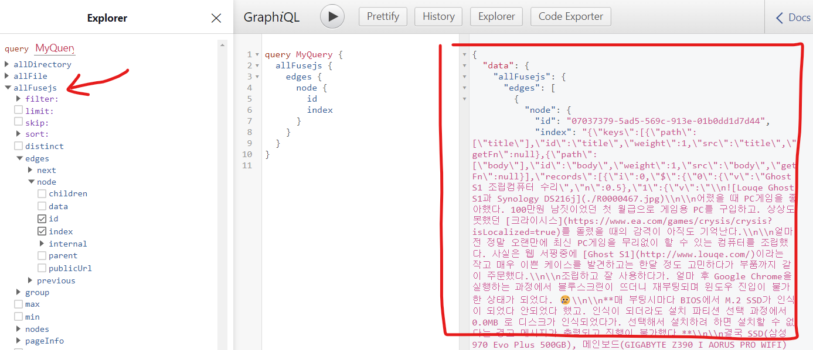

# gatsby에 검색을 추가하는 방법

블로그에 글이 늘어나면 카테고리와 태그만으로는 원하는 내용을 찾기 어려워진다. 지금 블로그가 그 정도까지 내용이 많지는 않지만 학습을 위해 운영하는것도 있어서 검색 기능을 구현해 보았다.



공식 사이트의 [gatsby 에 검색 기능 추가](https://www.gatsbyjs.com/docs/how-to/adding-common-features/adding-search/) 문서를 보면 검색에 필요한 기본 요소들에 대한 설명과 함께 gatsby에 검색을 구현하는 2가지 방법을 소개하고 있다.

첫 번째 방법은 클라이언트 측 검색이다. 빌드 혹은 런타임에 데이터를 인덱싱하고 이를 이용해 로컬에서 검색을 수행하는 방법이다. 위의 공식 문서에서는 js-search, gatsby-plugin-elasticlunr-search, gatsby-plugin-local-search 를 활용하라고 안내하고 있다.

두 번째 방법은 API기반 검색엔진을 활용하는 방법으로 Algolia와 같은 외부 서비스를 활용한다. 빌드 시점에 검색 대상 데이터들을 인덱싱해 외부 서비스에 업로드해 두고 런타임에는 API로 검색한다.

**API기반 검색엔진사용 시 블로그의 빌드 배포 프로세스에 인덱스를 전송해야 하는 번거로움과. 사용 시 비용이 발생하거나. 무료인 경우 횟수에 제약이 있어 사용하고 싶지 않았다.** 결국 클라이언트 측 검색 방법으로 검색을 구현했다. 이 글에서는 구현 과정에 대해서 다룬다.

# 검색 라이브러리와 한글 이슈

사실 검색은 단순히 글 목록을 순회하며 텍스트가 포함되어있는지를 검사해도 된다. 하지만 실제 사용시에는 포함 뿐만 아니라 상황에 따라 아래의 기능들을 필요로 하는데 이 경우 추가 구현이 필수이므로. 대개 별도의 텍스트 검색 라이브러리를 사용하게 된다.

- 배열의 모든 요소를 순회하지 않고도 빠르게 검색할 수 있는 기능 (인덱스 생성 및 사용)
- 제목보다 본문에 조금 더 가중치를 두고 검색 (필드 가중치 적용)
- 검색어 하이라이팅을 위한 매칭 텍스트 위치 배열
- and, or 논리 연산 검색 등

gatsby 공식 사이트의 [gatsby 에 검색 기능 추가](https://www.gatsbyjs.com/docs/how-to/adding-common-features/adding-search/) 문서에는 js-search, flexsearch, lunr 세가지 라이브러리를 추천하고 있는데. 설명 자체가 장황하거나 flexsearch, lunr는 둘 다 한글 검색 관련 문제<sup>[\[1\]](#footnote_1)</sup>가 있어 사용이 어려웠다.

한참을 디버깅하다 결국 실무에서 특별한 문제없이 잘 사용하고 있는 fuse.js를 활용해보기로 했다.

# fuse.js의 사용

[fuse.js](https://fusejs.io/)는 텍스트 검색 라이브러리로 위에 적힌 모든 기능을 제공하며. 브라우저 / NodeJS환경 둘다에서 사용할 수 있으므로 gatsby의 빌드 과정에서는 인덱스를 생성해 두고. 런타임에 사용하여 검색하도록 구성하면 된다.

fuse.js에 대한 자세한 내용은 공식 사이트에서 확인할 수 있으니 생략하고. 본문에서는 이 글의 핵심인 인덱스의 생성 및 사용 방법에 대해서만 다룬다.

## 인덱스 생성 및 사용

```js
import Fuse from 'fuse.js'

const books = [
  {
    title: "Old Man's War",
    author: { firstName: 'John', lastName: 'Scalzi' },
  },
  {
    title: 'The Lock Artist',
    author: { firstName: 'Steve', lastName: 'Hamilton' },
  },
  // {...}, {...}, ...
]

// index 생성
const index = Fuse.createIndex(['title', 'author.firstName'], books)

// 예시를 위해 로컬스토리지에 저장한다
localStorage.setItem('index', JSON.stringify(index.toJSON()))
```

`createIndex`메서드 호출로 만들어진 index객체는 fusejs가 books를 검색하는데 있어 순회를 줄일 수 있는 정보를 담고 있는 인스턴스이다. 이 인스턴스는 `toJSON()`메서드를 통해 json문자열로 변환도 가능하여. 스토리지에 담거나 API로 보내거나 하는 등 유용하게 쓸 수 있다

```js
import Fuse from 'fuse.js'

const index = Fuse.parseIndex(JSON.parse(localStorage.getItem('index')))

// 원본 데이터와 인덱스를 가지고 최적화 된 검색을 수행할 수 있는 인스턴스 생성
const fuse = new Fuse(books, undefined, index)

const result = fuse.search('검색어')
```

이렇게 만들어진 인덱스 인스턴스와 원본 데이터를 가지고 텍스트 검색을 수행할 수 있다.

## gatsby에서 fuse.js 활용하기

앞서 언급했던 대로 **빌드 과정에서는 목록을 인덱싱하여 어딘가 저장해두어야 하고** 이렇게 생성된 데이터는 **블로그의 런타임에 fuse.js 인스턴스를 만들어 사용하도록 구성**해야 한다.

이때 빌드 과정은 플러그인을 활용하면 되고. 런타임 검색은 훅을 활용하면 된다.

# gatsby-plugin-fusejs

```bash
npm install gatsby-plugin-fusejs
```

설치 후 gatsby-config.js에 인덱스가 만들어지기 원하는 데이터의 쿼리, 데이터 중에서도 검색이 되었으면 하는 프로퍼티, graphql결과물을 단순 객체 배열로 변환하기 위한 함수를 옵션으로 전달한다

```js
module.tsports = {
  plugins: [
    {
      resolve: `gatsby-plugin-fusejs`,
      options: {
        // 인덱스를 만들고자 하는 데이터의 쿼리
        query: `
          {
            allMarkdownRemark {
              nodes {
                id
                rawMarkdownBody
                frontmatter {
                  title
                }
              }
            }
          }
        `,

        // 인덱스를 만들고자 하는 데이터의 프로퍼티
        keys: ['title', 'body'],

        // graphql의 결과물을 단순 객체 배열로 변환하는 함수
        normalizer: ({ data }) =>
          data.allMarkdownRemark.nodes.map(node => ({
            id: node.id,
            title: node.frontmatter.title,
            body: node.rawMarkdownBody,
          })),
      },
    },
  ],
}
```



# react-use-fusejs

```bash
npm install react-use-fusejs
```

다음은 만들어진 인덱스를 활용하기 위해 fuse.js 훅을 설치한다. 예제에서는 Search라는 컴포넌트를 만들고. `useStaticQuery`로 컴포넌트 단위 쿼리로 인덱스와 원본 데이터를 불러온 후 검색어 입력시마다 결과를 화면에 노출하고 있다.

```jsx
import { graphql, useStaticQuery } from 'gatsby'
import * as React from 'react'
import { useGatsbyPluginFusejs } from 'react-use-fusejs'

export function Search() {
  const data = useStaticQuery(graphql`
    {
      fusejs {
        index
        data
      }
    }
  `)

  const [query, setQuery] = React.useState('')

  // fusejs 객체를 가공 없이 그대로 넘긴다
  const result = useGatsbyPluginFusejs(query, data.fusejs)

  return (
    <div>
      <input
        type="text"
        value={query}
        onChange={e => setQuery(e.target.value)}
      />
      <ul>
        {result.map(({ item }) => (
          <li key={item.id}>{item.title}</li>
        ))}
      </ul>
    </div>
  )
}

export default Search
```

위 예제의 경우 검색어 입력시 검색결과가 즉시 화면에 노출되는데. 이 것을 조절하려면 `query`의 변화에 throttle이나 debounce를 활용하면 해결할 수 있을 것이다.

# 인덱스를 Lazy Loading하기

Search컴포넌트는 렌더링 즉시 인덱스를 파싱하여 인스턴스를 만들기 때문에 검색을 하지 않더라도 자원을 소모하게 된다. 문서량이 적다면 괜찮겠지만 많아지는 경우 신경이 쓰일 수 있는데. 그 경우를 위해 Lazy Loading을 적용할 수 있다.

아래 코드는 실제 검색 키워드가 입력될 때 즉시 인덱스를 다운로드 받고 파싱하여 검색을 수행하는 예제이다.

```jsx{21}
import { graphql, useStaticQuery } from 'gatsby'
import * as React from 'react'
import { useGatsbyPluginFusejs } from 'react-use-fusejs'

export function Search() {
  const data = useStaticQuery(graphql`
    {
      fusejs {
        publicUrl
      }
    }
  `)

  const [query, setQuery] = React.useState('')
  const [fusejs, setFusejs] = React.useState(null)
  const result = useGatsbyPluginFusejs(query, fusejs)

  const fetching = React.useRef(false)

  React.useEffect(() => {
    if (!fetching.current && !fusejs && query) {
      fetching.current = true

      fetch(data.fusejs.publicUrl)
        .then(res => res.json())
        .then(json => setFusejs(json))
    }
  }, [fusejs, query])

  return (
    <div>
      <input
        type="text"
        value={query}
        onChange={e => setQuery(e.target.value)}
      />
      <ul>
        {result.map(({ item }) => (
          <li key={item.id}>{item.title}</li>
        ))}
      </ul>
    </div>
  )
}

export default Search
```

## 인덱스 재사용하기

위의 예제에서 다운로드 받아 만든 fuse.js 데이터는 컴포넌트가 제거되면 함께 사라진다. 따라서 데이터를 컨텍스트에 담아 재사용하도록 한다.

```jsx
// src/context/app.jsx
import { createContext, useState } from 'react'

export const AppContext = createContext({
  fusejs: null,
  setFusejs: () => {},
})

export const AppProvider = ({ children }) => {
  const [fusejs, setFusejs] = useState(null)

  return (
    <AppContext.Provider value={{ fusejs, setFusejs }}>
      {children}
    </AppContext.Provider>
  )
}
```

```jsx
// gatsby-browser.js
import { AppProvider } from './src/context/app'

export const wrapRootElement = ({ element }) => {
  return <AppProvider>{element}</AppProvider>
}
```

```jsx{17,23}
// src/components/Search.jsx
import { AppContext } from '../context/app'
import { graphql, useStaticQuery } from 'gatsby'
import * as React from 'react'
import { useGatsbyPluginFusejs } from 'react-use-fusejs'

export function Search() {
  const data = useStaticQuery(graphql`
    {
      fusejs {
        publicUrl
      }
    }
  `)

  const [query, setQuery] = React.useState('')
  const [fusejs, setFusejs] = React.useContext(AppContext)
  const result = useGatsbyPluginFusejs(query, fusejs)

  const fetching = React.useRef(false)

  React.useEffect(() => {
    if (!fetching.current && !fusejs && query) {
      fetching.current = true

      fetch(data.fusejs.publicUrl)
        .then(res => res.json())
        .then(json => setFusejs(json));
    }
  }, [fusejs, query])

  return (
    <div>
      <input
        type="text"
        value={query}
        onChange={e => setQuery(e.target.value)}
      />
      <ul>
        {result.map(({ item }) => (
          <li key={item.id}>{item.title}</li>
        ))}
      </ul>
    </div>
  )
}

export default Search
```

> # 주석
>
> <a name="footnote_1">1.</a> lunr의 한글 검색 이슈는 [Jekyll에 lunr.js 붙이기 \(+ 한국어 검색 문제 해결\)](https://cjeon.com/2016/05/29/Jekyll-lunr.html) 에서 볼 수 있고. flexsearch의 한글 검색 이슈는 [gatsby를 이용한 Github blog 개발후기](https://jaeseokim.dev/React/gatsby-blog-%EA%B0%9C%EB%B0%9C-%ED%9B%84%EA%B8%B0/#%EB%91%90-%EB%B2%88%EC%A7%B8-%EA%B3%A0%EB%AF%BC---%EA%B2%80%EC%83%89-%EA%B8%B0%EB%8A%A5)에서 볼 수 있으며. [공식 문서](https://github.com/nextapps-de/flexsearch#cjk-word-break-chinese-japanese-korean)를 따라해도 동작하지 않는다.
